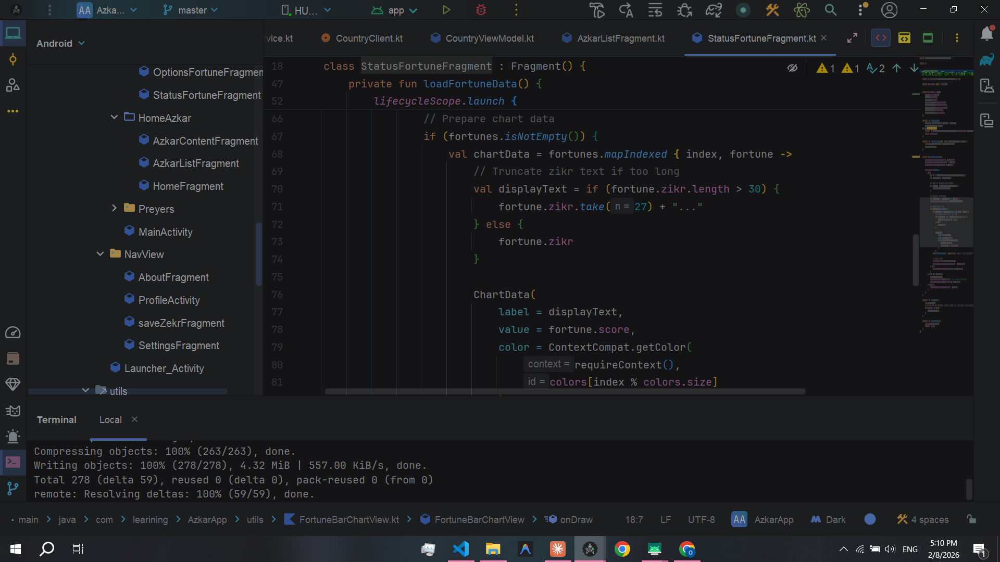

# Azkar App

A comprehensive Islamic Android application designed to help Muslims maintain daily remembrance of Allah (Azkar), track worship activities, and strengthen their spiritual routine.

## Features

### Azkar Counter
- Morning, Evening, Sleep, and Wake-up supplications
- Tap-to-count tracker for each dhikr
- Save your favorite azkar for quick access

### Kanz (Fortune/Virtues Tracker)
- Gamified scoring system to encourage consistent worship
- Quick-add buttons (x10, x20, x50, x100) for batch tracking
- Detailed preview dialog with hadith sources
- Bar chart visualization of your progress

### Missed Prayers Calculator
- Calculate missed prayers by entering years or months
- Track each prayer individually (Fajr, Dhuhr, Asr, Maghrib, Isha)
- Increment/decrement counters as you make up prayers

### Fasting Tracker
- Day-by-day fasting log
- Track your fasting progress over time

### Islamic Content (Dawa Lists)
- Curated Islamic sermon playlists
- Direct links to YouTube lectures
- Favorite and browse collections

### Prayer Times
- Real-time prayer times based on your city
- Powered by the Aladhan API
- Configurable location (country & city selection)

### Additional Features
- Dark / Light mode support
- User profiles with Firebase authentication
- Google Sign-In integration
- Admin panel for content management

## Screenshots

<p align="center">
  
</p>

## Tech Stack

| Category | Technology |
|----------|-----------|
| Language | Kotlin 2.0.0 |
| UI | XML Layouts, Material Design 3 |
| Architecture | MVVM (ViewModel + LiveData + Coroutines) |
| Local Database | Room 2.6.1 |
| Cloud Backend | Firebase (Auth, Firestore, Storage, Analytics) |
| Networking | Retrofit 2.9.0 + OkHttp 4.12.0 |
| Image Loading | Glide 4.16.0 |
| Navigation | Jetpack Navigation Component 2.7.7 |
| Preferences | DataStore 1.1.1 |
| Authentication | Firebase Auth + Google Sign-In |
| Min SDK | 24 (Android 7.0) |
| Target SDK | 36 |

## Project Structure

```
app/src/main/java/com/learining/AzkarApp/
├── Adapter/                # RecyclerView Adapters
│   ├── AzkarAdapter        # Azkar list with counter & save
│   ├── FortuneAdapter      # Fortune cards with score system
│   ├── DawaAdapter         # Dawa playlist cards
│   ├── FastingDayAdapter   # Fasting day items
│   └── SavedAzkarAdapter   # Saved azkar items
│
├── APIs/                   # Retrofit API Services & ViewModels
│   ├── PrayerTimesViewModel
│   ├── CityViewModel
│   └── CountryViewModel
│
├── Data/
│   ├── model/              # Data classes (Room entities & API models)
│   └── network/            # Retrofit client configurations
│
├── DataBase/               # Room Database
│   ├── MyDataBase           # Database definition (4 entities)
│   ├── AzkarDAO
│   ├── PrayerDAO
│   ├── FastingDAO
│   └── FortuneDao
│
├── UI/
│   ├── Launcher_Activity    # Splash screen
│   ├── BotNav/              # Bottom Navigation sections
│   │   ├── MainActivity
│   │   ├── HomeAzkar/       # Azkar (Home, List, Content)
│   │   ├── Fortune/         # Kanz (Main, Counter, Options, Status)
│   │   ├── Preyers/         # Missed prayers & fasting
│   │   ├── DawaLists/       # Islamic content
│   │   └── Admin/           # Admin panel
│   └── NavView/             # Drawer Navigation items
│       ├── AboutFragment
│       ├── SettingsFragment
│       ├── saveZekrFragment
│       └── ProfileActivity
│
└── utils/                   # Utilities
    ├── UsagePreferences      # DataStore preferences manager
    ├── FortuneBarChartView   # Custom chart view
    ├── FileUtils
    └── SendMail
```

## APIs Used

| API | Purpose |
|-----|---------|
| [Aladhan](https://aladhan.com/prayer-times-api) | Prayer times by city |
| Cloudinary | Image upload & storage |
| Firebase Firestore | Cloud data sync |

## Getting Started

### Prerequisites
- Android Studio Hedgehog or newer
- JDK 17
- Android SDK 36

### Setup
1. Clone the repository
   ```bash
   git clone https://github.com/YOUR_USERNAME/AzkarApp.git
   ```
2. Open the project in Android Studio
3. Add your `google-services.json` file in the `app/` directory for Firebase
4. Sync Gradle and build the project
5. Run on an emulator or physical device (min API 24)

## Architecture

The app follows the **MVVM** pattern:

```
View (Fragments/Activities)
  ↕ Data Binding / View Binding
ViewModel (LiveData + Coroutines)
  ↕
Repository Layer
  ↕              ↕
Room DB      Retrofit APIs
(Local)       (Remote)
```

- **Room** handles local persistence for azkar, fortunes, missed prayers, and fasting days
- **Firebase** manages authentication, user profiles, and dawa content
- **Retrofit** fetches prayer times and location data
- **DataStore** stores user preferences (theme, location, settings)
- **Coroutines** handle all async operations

## License

This project is open source and available under the [MIT License](LICENSE).
